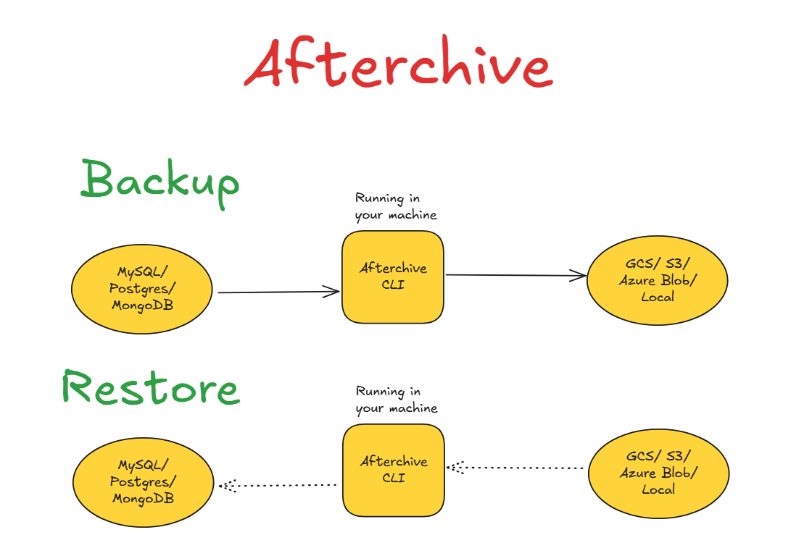

# Afterchive - A Database Backup Orchestrator

A work-in-progress **Database Backup Utility Orchestrator** for safe and reliable database backups. 

Currently, the tool is **early-stage** and many features are in development.  

---
## Overview

When I was a software engineer at Hughes, I used to write shell scripts that was heavily backing up databases in orchestrated manner. Therefore, I wanted to build this tool that will be helpful with managing databases backups between machine and cloud storage. The tool is open source to support other engineers.  



---

## Roadmap for MVP

### v0.1.0 (Currently in testing) ✅
- [x] PostgreSQL backup/restore
- [x] GCS and Local storage
- [x] YAML configuration
- [x] Environment variable support

### v0.2.0 (Planned)
- [ ] Launch to PyPI  
- [ ] MySQL support
- [ ] AWS S3 storage
- [ ] Compression & checksums

### v0.3.0 (Planned)
- [ ] Retention policies
- [ ] Azure Blob storage
- [ ] Scheduling (cron / built-in job runner)
- [ ] Notifications (Slack, Email)

### v1.0.0 (Planned)
- [ ] Multiple backup jobs
- [ ] Encryption (GPG or AES)
- [ ] Advanced orchestration
- [ ] MongoDB support


---

## Requirements
#### PostgreSQL Version Requirements

**IMPORTANT:** Your `pg_dump` version must be >= your database version.


---

## Installation

> Please note: this is subject to change as this package is not deployed to PyPI

```bash
#clone the repo
git clone <repo-url>
cd <repo-name>
pipx install -e .

# to support all the availible cloud storages and databases use:
pipx install -e .[all]

# to use it for only certain stuff use:
pipx install -e .[postgres,gcp]
```

## Usage

With verbose CLI flags

```bash
afterchive backup\
  --db-type postgres \ # this would be to specfiy the db type (e.g. postgres or mysql)
  --db-host localhost \
  --db-port 5432 \
  --db-user admin \
  --db-pass bigsecret \ # when password not provideed user will be prompted
  --db-name collegegrades \
  --storage gcs \
  --bucket my-db-backups \
  --path dbbu\ # the path of the directory (not file name) 
  --project my-gcp-project # project name would mostly be optional
```

with yaml file

```bash
afterchive backup --config <path-to-yaml.yaml>

```
see [example.yaml](example.yaml) to follow the yaml structure properly

---

## Contribution Policy

At this stage, this project is **not open for public contributions**.  
I am still actively developing the core features, and the roadmap may change quickly.  

If you’re genuinely interested in contributing:  
- Please reach out directly before submitting any pull requests.  
- You can connect with me on [LinkedIn](https://www.linkedin.com/in/asemshaath/) or contact me through another channel.  

Once the project matures, I will open it up for broader community contributions.  

---

## Vision

The end goal is a **config-driven, multi-DB backup orchestrator** with support for:  
- Multiple databases (Postgres, MySQL, MongoDB, etc.)  
- Multiple storage providers (Local, GCS, AWS S3, Azure Blob)  
- Secure encryption & easy restore  
- Simple automation/scheduling  

The end goal will have 3 main functionalities:
- 1 db &harr; 1 storage location
- 1 db &harr; multiple storage locations
- multiple databases &harr; multiple storage locations
---

## License

MIT License. See `LICENSE` for details.

---

*This project is still under active development. Expect rough edges, but contributions/feedback are welcome!*  

*This project is inspired by https://roadmap.sh/projects/database-backup-utility*
